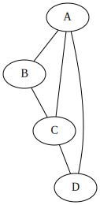

# Bore


<!-- WARNING: THIS FILE WAS AUTOGENERATED! DO NOT EDIT! -->

------------------------------------------------------------------------

<a
href="https://github.com/akrishnamo/mytestrepo/blob/main/mytestrepo/bore.py#L13"
target="_blank" style="float:right; font-size:smaller">source</a>

### foo

``` python

def foo(
    a:int
):

```

``` python
import networkx as nx
from IPython.display import display, SVG
import io
# Use graphviz Python package to render
import graphviz
```

``` python
# Create a small graph
G = nx.Graph()
G.add_edges_from([
    ('A', 'B'),
    ('B', 'C'),
    ('C', 'D'),
    ('D', 'A'),
    ('A', 'C')
])

# Generate DOT format string
dot_string = nx.nx_pydot.to_pydot(G).to_string()
# print("DOT format:")
# print(dot_string)


dot = graphviz.Source(dot_string)
dot.format = 'svg'
display(SVG(dot.pipe()))
```


